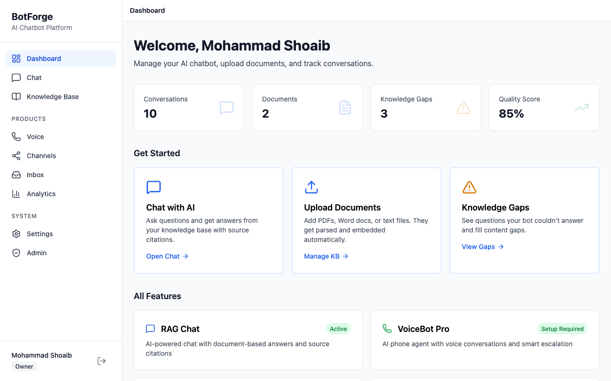
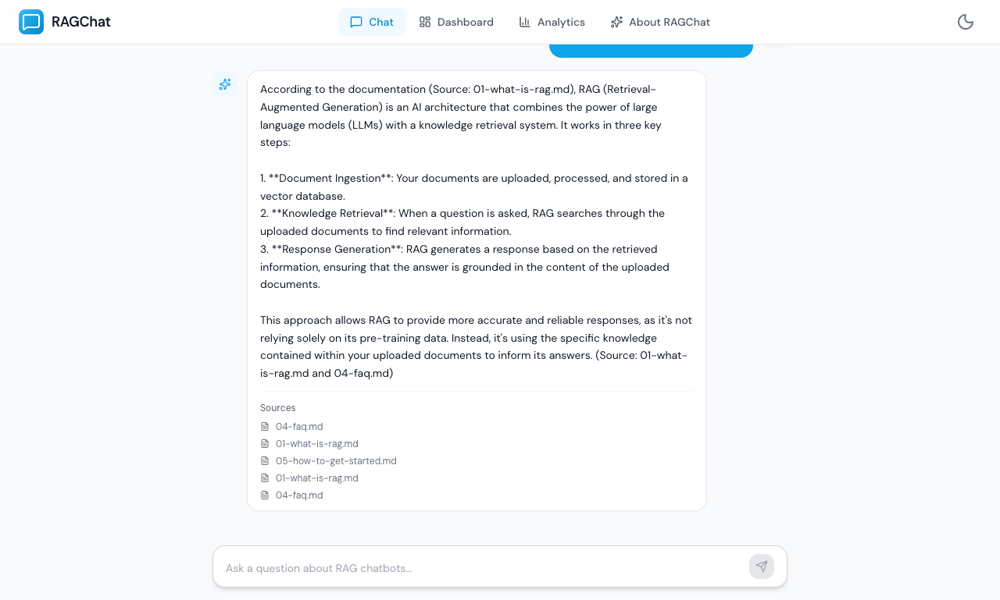
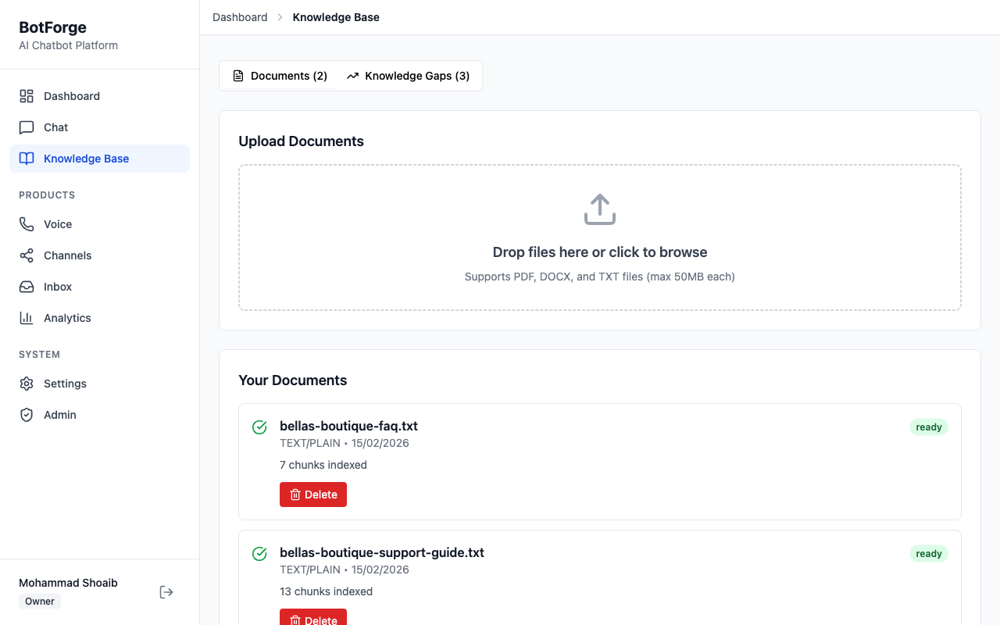
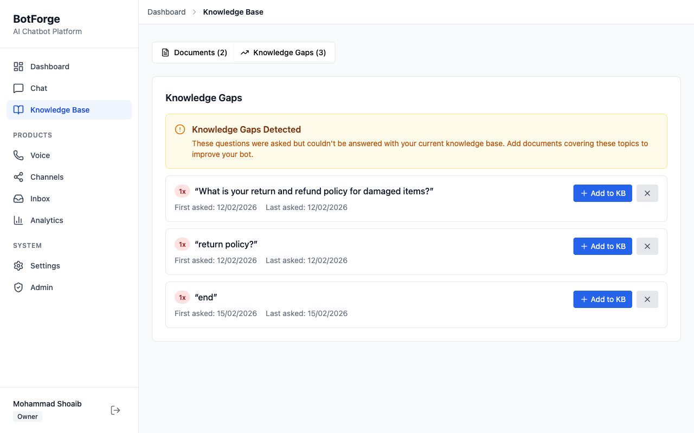
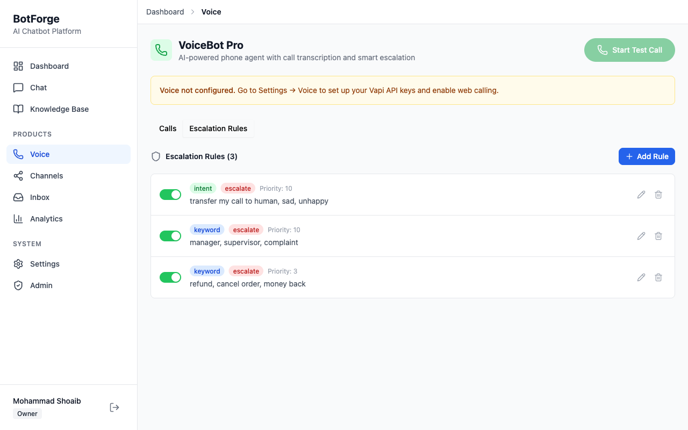
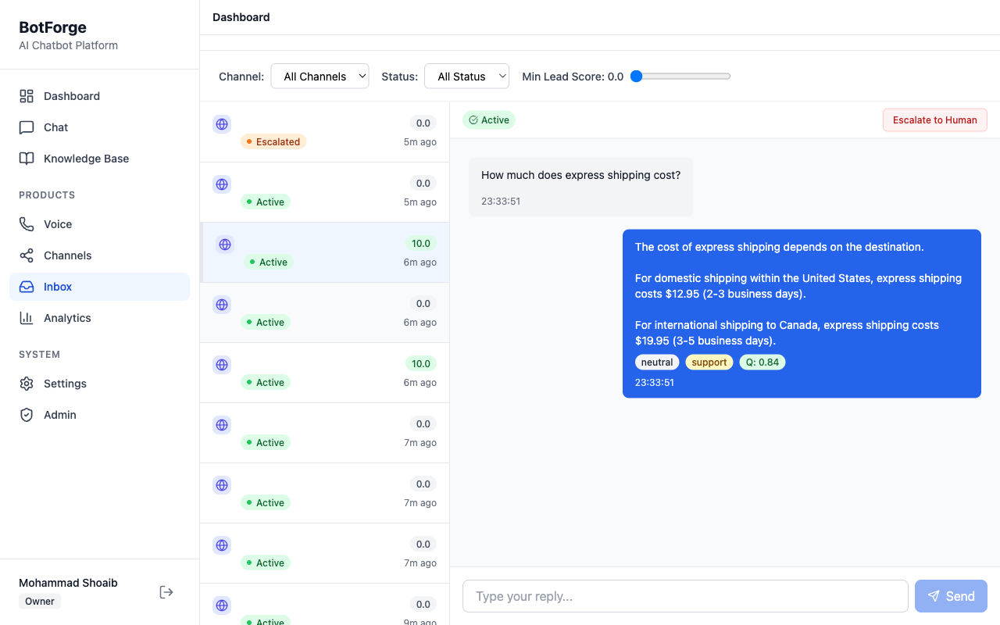
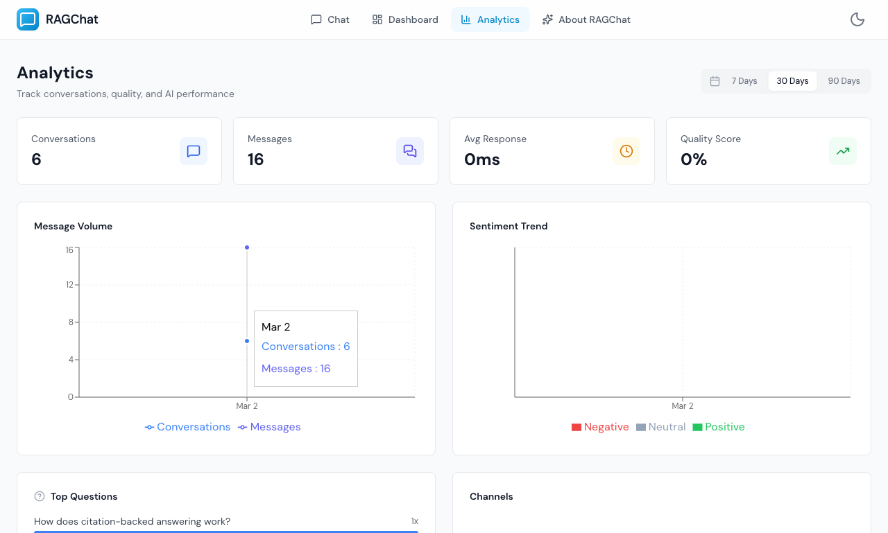

# Fenlo AI — Full-Stack AI Chatbot Platform

A production-grade AI chatbot platform that lets businesses deploy intelligent customer support across web, WhatsApp, voice, and more. Upload your documents, get a working AI agent in minutes.

**Live**: [bot.fenloai.com](https://bot.fenloai.com)

---



## What It Does

| Module | Description |
|--------|------------|
| **RAG Chat** | Upload PDFs/DOCX/TXT, ask questions, get answers with source citations. Detects knowledge gaps automatically. |
| **VoiceBot Pro** | AI phone agent via Vapi. Escalation rules (keyword, sentiment, silence detection), call transcripts, live monitoring. |
| **OmniBot Inbox** | Unified inbox across WhatsApp (Twilio), embeddable web widget, Telegram. Human handoff to Freshdesk when needed. |
| **Analytics** | Sentiment analysis, intent classification, lead scoring, quality metrics, AI-generated weekly insights. |
| **GDPR** | Data export, account purge with audit trail, consent management. |

## Screenshots

<details>
<summary><strong>RAG Chat with Source Citations</strong></summary>



Every response includes references to the source documents it used.
</details>

<details>
<summary><strong>Knowledge Base Management</strong></summary>



Upload documents (PDF, DOCX, TXT). They get chunked, embedded, and indexed automatically.
</details>

<details>
<summary><strong>Knowledge Gap Detection</strong></summary>



The system tracks questions it couldn't answer and flags content gaps for you to fill.
</details>

<details>
<summary><strong>Voice Agent with Escalation Rules</strong></summary>



Configure keyword, sentiment, and silence-based escalation rules. Calls get transcribed in real time.
</details>

<details>
<summary><strong>Unified Inbox with Human Handoff</strong></summary>



All conversations in one place. Lead scores, sentiment tags, and one-click escalation to human agents.
</details>

<details>
<summary><strong>Analytics Dashboard</strong></summary>



Message volume, sentiment trends, top questions, channel breakdown, quality scores.
</details>

## Architecture

```
Browser --> Nginx (SSL termination)
  |-- /api/*  --> FastAPI (REST + WebSocket)
  |-- /*      --> Next.js (SSR + static)

                FastAPI
                  |
    +-------------+-------------+
    |             |             |
PostgreSQL     Redis        Pinecone
 (data)     (cache/queue)  (vectors)
```

### Message Pipeline

Every message flows through a composable pipeline of processing steps:

```
User Message
  --> LoadContext        # conversation history + system prompt
  --> PromptGuard        # input safety check
  --> RAGRetrieval       # semantic search with Redis cache
  --> LLMStream          # Groq (primary) --> OpenAI (fallback)
  --> SentimentAnalysis  # positive / neutral / negative
  --> IntentClassifier   # FAQ, sales, support, escalation
  --> QualityScorer      # response quality 0.0-1.0
  --> LeadScoring        # accumulated per conversation
  --> Persistence        # save to DB
```

### Key Engineering Decisions

- **LLM Router with Circuit Breaker** -- Groq as primary (fast, free), automatic failover to OpenAI after N failures. Self-heals when Groq recovers.
- **Semantic Cache** -- Redis-backed query cache (SHA256 hash, 1hr TTL) to avoid redundant embedding + LLM calls.
- **Workspace Isolation** -- Every DB query scoped to `workspace_id`. JWT carries workspace context. Multi-tenant by design.
- **Event Bus** -- Decoupled cross-module communication (e.g., knowledge gap created triggers analytics update).
- **Background Workers** -- ARQ (Redis-backed) for async document processing: parse, chunk, embed, upsert to Pinecone.

## Tech Stack

| Layer | Technology |
|-------|-----------|
| **Frontend** | Next.js 15, React 19, TypeScript, Tailwind CSS, shadcn/ui, Zustand, React Query |
| **Backend** | FastAPI, Python 3.12, SQLAlchemy (async), Pydantic v2, LangChain |
| **Database** | PostgreSQL (RDS), Redis (cache + job queue) |
| **Vector Store** | Pinecone (semantic search + RAG retrieval) |
| **LLM** | Groq (primary) / OpenAI (fallback) with circuit breaker |
| **Voice** | Vapi (phone agent, WebRTC, transcription) |
| **Channels** | Twilio (WhatsApp), embeddable JS widget (HMAC auth), Telegram Bot API |
| **Handoff** | Freshdesk (ticket creation, auto-resolve stale conversations) |
| **Infra** | AWS EC2 + RDS (free tier), Nginx, systemd, GitHub Actions CI/CD |
| **Testing** | pytest (388+ tests, 80%+ coverage), Vitest + Playwright (frontend) |

## Project Structure

```
botforge/backend/                  # FastAPI API server
  app/
    api/                           # Route handlers (auth, chat, kb, voice, channels...)
    core/                          # Conversation engine, LLM router, pipeline steps
    models/                        # SQLAlchemy ORM (14+ tables)
    services/                      # Voice provider, escalation engine, handoff
    middleware/                    # CORS, RBAC, rate limiting, workspace scope
  worker.py                        # ARQ background jobs (doc processing, embeddings)
  tests/                           # Unit + integration tests
  alembic/                         # Database migrations
frontend/                          # Next.js 15 application
  app/                             # App Router (dashboard, chat, kb, voice, analytics...)
  components/                      # UI components (shadcn/ui based)
  hooks/                           # useChat, useRAGChat (WebSocket with backoff)
  stores/                          # Zustand state management
  widget/                          # Embeddable chat widget (standalone build)
docker-compose.yml                 # Local dev: Postgres + Redis
```

## Local Development

```bash
# Prerequisites: Docker, Python 3.12+, Node.js 20+, uv

# Start databases
docker compose up -d

# Backend
cd botforge/backend
uv sync
uv run alembic upgrade head
uv run uvicorn app.main:app --reload --port 8000

# Worker (document processing)
python worker.py

# Frontend (separate terminal)
cd frontend
npm install
npm run dev
```

Copy `.env.example` to `.env` and fill in your API keys. See comments in the file for details.

## Testing

```bash
# Backend -- 388+ tests, 80%+ coverage
cd botforge/backend
pytest
pytest --cov=app --cov-report=html

# Frontend
cd frontend
npm test                    # Vitest (unit)
npx playwright test         # E2E
```

## License

Proprietary. All rights reserved.
